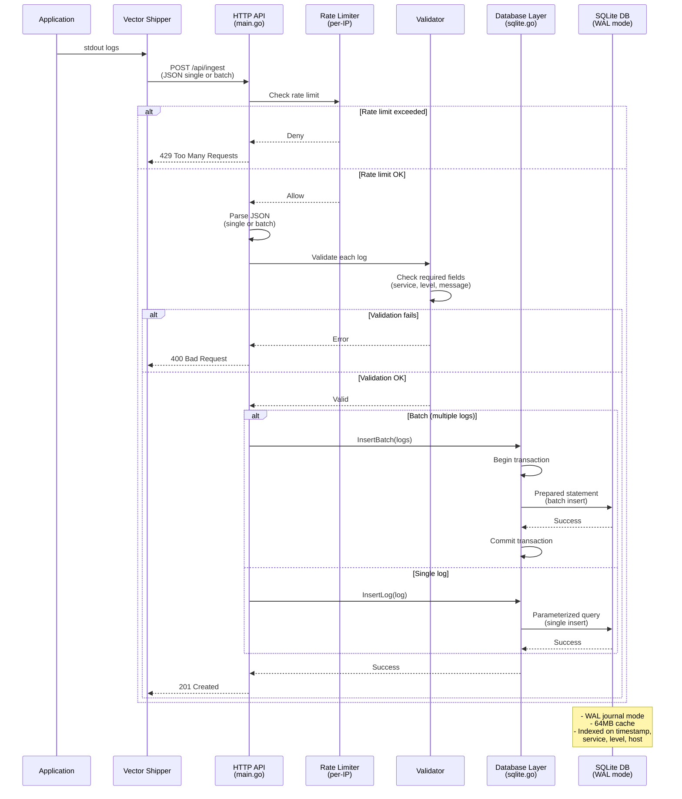
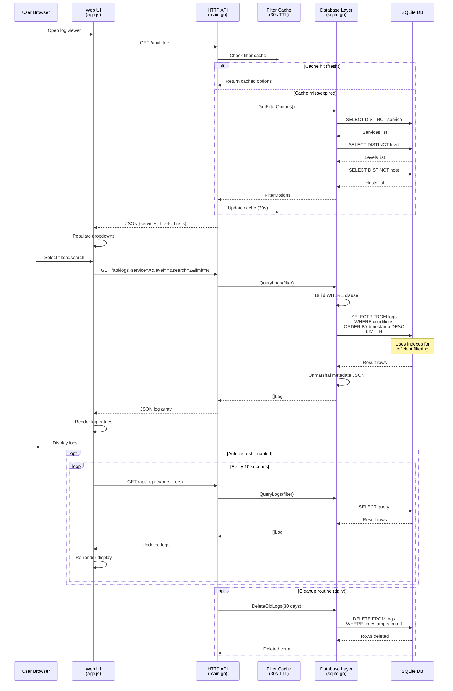

# CLAUDE.md

This file provides guidance to Claude Code (claude.ai/code) when working with code in this repository.

## Project Overview

Locog is a lightweight log aggregation system written in Go. It provides log ingestion via HTTP API, SQLite storage, and a web UI for viewing/filtering logs. Designed as a simpler alternative to enterprise solutions like Loki or OpenSearch.

## Build Commands

```bash
# Build the service
go build -o logservice ./cmd/logservice

# Run locally
./logservice -db /tmp/logs.db -addr :5081

# Run tests
go test ./...

# Run tests with coverage
go test ./... -coverprofile=coverage.out
go tool cover -html=coverage.out

# Build and run with Docker (self-build)
cd self-build && docker-compose up -d
```

## Architecture

**Data Flow:** Applications (stdout) → Vector (shipper) → Log Service (HTTP API) → SQLite DB → Web UI

**Key Components:**
- `cmd/logservice/main.go` - Single binary entry point, HTTP server, API handlers
- `internal/db/sqlite.go` - Database layer with prepared statements, connection pooling, WAL mode
- `internal/models/log.go` - Data models (Log, LogFilter, FilterOptions)
- `web/static/` - Browser-based UI with real-time filtering (vanilla JS, dark theme)
- `self-build/` - Docker Compose and Vector configuration (for building locally)

**Test Files:**
- `cmd/logservice/main_test.go` - HTTP handler and utility function tests
- `internal/db/sqlite_test.go` - Database layer tests (uses in-memory SQLite)
- `internal/models/log_test.go` - Model JSON serialization tests

**API Endpoints:**
- `POST /api/ingest` - Accept single or batch log entries
- `GET /api/logs` - Query logs with filtering (service, level, host, search, time range)
- `GET /api/filters` - Get available filter values for dropdowns
- `GET /health` - Health check
- `GET /` - Serve web UI

## Data Flow Diagrams

### Log Ingestion Flow



### User Query Flow



## Code Conventions

- Database operations go in `internal/db` package
- Models/data structures go in `internal/models` package
- Use prepared statements for all database queries
- Use parameterized queries (SQL injection prevention)
- Frontend uses Fetch API, no frameworks

## Database Schema

The SQLite database uses the following schema (see `schema.sql`):

```sql
CREATE TABLE logs (
    id INTEGER PRIMARY KEY AUTOINCREMENT,
    timestamp DATETIME NOT NULL,
    service VARCHAR(100) NOT NULL,
    level VARCHAR(20) NOT NULL,
    message TEXT NOT NULL,
    metadata JSON,
    host VARCHAR(255),
    created_at DATETIME DEFAULT CURRENT_TIMESTAMP
);
```

Indexes exist on: `timestamp DESC`, `service`, `level`, `host`, and composite `(service, timestamp DESC)`.

## SQLite Configuration

The database uses these pragmas for performance:
- `journal_mode=WAL` - Write-Ahead Logging for better concurrency
- `synchronous=NORMAL` - Faster writes, still safe
- `cache_size=-64000` - 64MB cache
- `busy_timeout=5000` - Wait 5s on lock

## Log Retention

The service automatically deletes logs older than 30 days via a daily cleanup routine.

## Manual Testing

```bash
# Ingest a test log
curl -X POST http://localhost:5081/api/ingest \
  -H "Content-Type: application/json" \
  -d '{
    "timestamp": "2025-01-19T10:30:00Z",
    "service": "test-app",
    "level": "INFO",
    "message": "Test log message",
    "host": "test-host",
    "metadata": {"user_id": 123}
  }'

# Query logs
curl "http://localhost:5081/api/logs?service=api-service&level=ERROR&limit=100"
curl "http://localhost:5081/api/logs?search=database"
```
